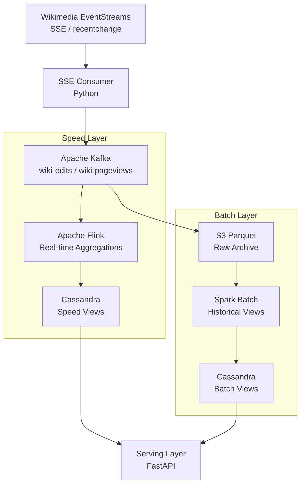

# Wikimedia Event Streaming — Lambda Architecture + Flink + Cassandra


Lambda Architecture implementation that consumes the public Wikimedia EventStreams (live Wikipedia edits, page views, and recent changes) via Server-Sent Events, processes in real-time with Flink, and persists to Cassandra for low-latency reads.

## Architecture



## Features

- Live consumption of Wikimedia SSE (Server-Sent Events) stream
- Real-time edit rate and page view aggregations per language/project
- Cassandra data model optimized for time-range and user-based queries
- Bot vs. human editor classification
- Vandalism detection based on revert patterns
- Batch layer recalculates historical accuracy nightly

## Tech Stack

| Layer | Technology |
|-------|-----------|
| Source | Wikimedia EventStreams (SSE) |
| Message Bus | Apache Kafka |
| Speed Processing | Apache Flink |
| Storage | Apache Cassandra |
| Batch | PySpark (S3 Parquet) |
| API | FastAPI |

## Prerequisites

- Docker & Docker Compose (8GB+ RAM)
- Python 3.10+
- No external API keys needed (Wikimedia is public)

## Quick Start

```bash
git clone https://github.com/zulham-tech/wikimedia-lambda-flink-cassandra.git
cd wikimedia-lambda-flink-cassandra
docker compose up -d
python consumers/sse_to_kafka.py  # starts consuming Wikipedia edits
# Flink UI: http://localhost:8081
```

## Project Structure

```
.
├── consumers/           # SSE → Kafka producers
├── flink_jobs/          # Speed layer Flink jobs
├── batch/               # PySpark batch recalculation
├── cassandra/           # CQL schemas for speed & batch views
├── serving/             # FastAPI serving layer
├── docker-compose.yml
└── requirements.txt
```

## Author

**Ahmad Zulham** — [LinkedIn](https://linkedin.com/in/ahmad-zulham-665170279) | [GitHub](https://github.com/zulham-tech)
